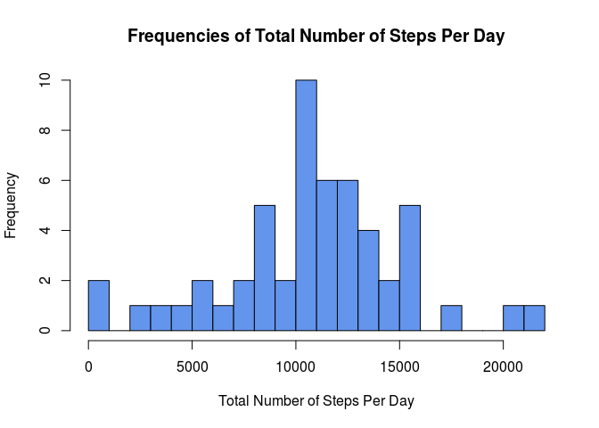
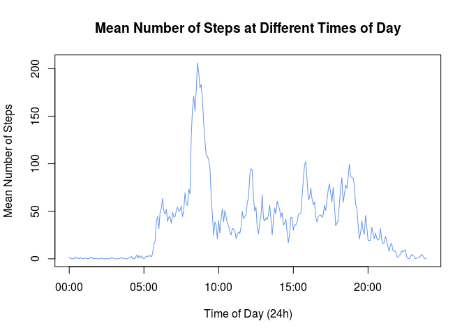
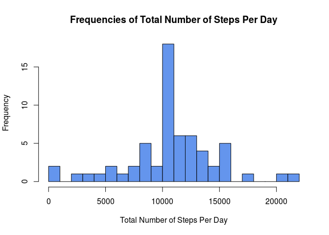
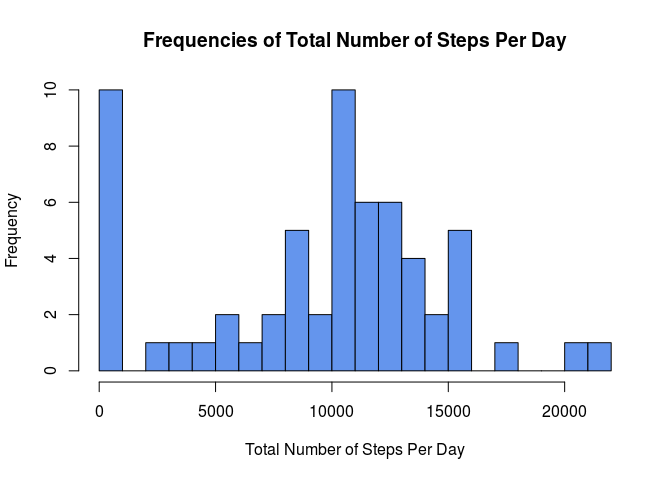

# Reproducible Research: Peer Assessment 1


## Loading and preprocessing the data
### Setup the data files
First, establish some settings regarding where the data is located:

```r
url = "https://d396qusza40orc.cloudfront.net/repdata%2Fdata%2Factivity.zip"
zipFile = "activity.zip"
dataDirectory = "data"
dataFile = "activity.csv"
```

Then, perform data caching. Check if the required data is already stored in the 
working directory. If the data has already been extracted into the "data" 
directory as a csv file, then nothing needs to be done at this stage. If the 
data esists only as a zip file in the working directory, then extract the data 
into a csv file. And if the data is not present at all, download and extract 
the data automatically from the source URL. 

```r
# Checks if the csv data exists
dataFilePath = paste(dataDirectory, dataFile, sep="/")
if(!file.exists(dataFilePath)){
    # Create the data directory if not already present
    if(!file.exists(dataDirectory)){
        dir.create(dataDirectory)
    }
    # Download the zip file from URL if its not already in working directory
    if (!file.exists(zipFile)) {
        download.file(url, destfile = zipFile, mode="wb")
    }
    # unzip the contents of the zip file into data directory
    unzip(zipFile, exdir=dataDirectory)
}
```

### Loading the data
Since it has now been established that the data exists in the data directory, we 
can load it into a data frame. 

```r
df = read.csv(dataFilePath)
```

### Preprocess the data
The data contains lots of missing values which interfere and skew the data, 
creating a disproportionate number of false zeroes if not removed. So a new 
column is created which flags all the rows with that do not contain missing 
values, so that all other rows can be filtered out when necessary. 

```r
library(dplyr)
df <- mutate(df, complete = complete.cases(df)) 
```

The data also contains a date field, so we need to convert the items in that 
column to be date objects instead of strings. 


```r
library(lubridate)
df$date = ymd(df$date)
```

The intervals are essentially time stamps, it will be useful to create a column 
that has actual times. 

```r
# add a column that converts the 5 minute intervals into actual times
df = mutate(df, interval.time = as.POSIXct(formatC(interval, width=4, flag="0"), 
                                           format="%H%M"))
```

## What is mean total number of steps taken per day?
### Visualising frequency of total daily steps
A histogram is plotted to give us an idea of how the frequencies for different 
number of steps are distributed. 

```r
# Filter out rows with missing values, then group by date, and sum over the 
# step values 
df.StepsPerDay <- summarise(group_by(df[df$complete,], date), 
                            total.steps=sum(steps, na.rm=TRUE))
# Plot it
hist(df.StepsPerDay$total.steps, breaks=20, col="red", 
     xlab="Total Number of Steps Per Day",
     main="Frequencies of Total Number of Steps Per Day")
```

 

A value of 20 breaks reveals regions which may be skewing the data. If the 
rows with missing data had not been filtered out then we would see a large 
spike in the frequency for zero steps. This spike occurs even when the 
```na.rm=TRUE``` option is used in the ```sum()``` and 
```mean()``` functions. This is because ```sum()``` returns 0 if it is asked to 
sum over a vector composed exclusively of NAs. So by the time the ```mean()``` 
function is called, any values which should have been NAs are now zeroes, and 
```mean()``` does not (and should not) filter out zeroes.

A smaller number of breaks would hide the presence of such a problematic peak 
from our view, due to the very small frequencies for steps higher than 0 but 
less than 5000. 

### Mean and median of total daily steps
We can find out what the mean and median number of total daily steps is. 

```r
mean.dailySteps <- mean(df.StepsPerDay$total.steps, na.rm=TRUE)
median.dailySteps <- median(df.StepsPerDay$total.steps, na.rm=TRUE)
```


```r
mean.dailySteps
```

```
## [1] 10766.19
```

```r
median.dailySteps
```

```
## [1] 10765
```

We find that the mean number of total daily steps is 
**10766.19** and the median number of total daily 
steps is **10765**. Both values are very close 
together, meaning that both are good measures of centrality for this data.


## What is the average daily activity pattern?
The average number of steps taken, averaged across all days can be plotted. 


```r
# group by the five minute intervals, and average out the number of steps 
# accross all days.
group.byInterval <- group_by(df[df$complete,], interval)
df.AvgStepsByInterval <- summarise(group.byInterval, 
                                   mean.steps=mean(steps, na.rm=TRUE))

# add a column that converts the 5 minute intervals into actual times
df.AvgStepsByInterval = mutate(df.AvgStepsByInterval, 
                               interval.time = as.POSIXct(formatC(interval, 
                                                                  width=4, 
                                                                  flag="0"), 
                                                          format="%H%M"))

# Finally plot it
with(df.AvgStepsByInterval, plot(mean.steps~interval.time, type="l", 
                                 xlab="Time of Day (24h)", 
                                 ylab="Mean Number of Steps",
                                 main="Mean Number of Steps at Different Times of Day"))
```

 

From the plot we can see that on average, the greatest amount of activity occurs 
in the morning sometime between 5 am and 10am. We can calculate the exact time 
interval that receives the most activity.


```r
maxsteps = max(df.AvgStepsByInterval$mean.steps)
maxsteps.row = df.AvgStepsByInterval[df.AvgStepsByInterval$mean.steps == maxsteps, ]
maxsteps.interval = maxsteps.row[[1,"interval"]]
maxsteps.interval
```

```
## [1] 835
```

This tells us that the time interval that on averave receives the most activity 
is **835**, which corresponds to the time 
**8:35**


## Imputing missing values
There are a number of days/intervals where there are missing values (coded as 
NA). The presence of missing days may introduce bias into some calculations or 
summaries of the data.

The total number of missing values in the dataset (i.e. the total number of 
rows with NAs) is: 

```r
sum(!df$complete)
```

```
## [1] 2304
```

That is a lot of missing values! One strategy is to simply filter out the rows 
that contain missing values, as was done in previous sections of this document. 
Another approach is to replace them with some reasonable values. 

Since the average number of steps for each interval period has already been 
calculated, then this provides a convenient, and useful set of values to replace 
the missing values. 

A new dataframe will be created that contains the filled in values. 

```r
df.filled <- df
# For all rows in which there is missing data, replace the steps value to be the 
# average steps value for that particular interval 
for (i in which(!df.filled$complete)){
    df.filled[i,]$steps = subset(df.AvgStepsByInterval, 
                                 interval == df.filled[i,]$interval)$mean.steps[1]
}
```

A histogram is plotted to give us an idea of how the frequencies for different 
number of steps are distributed. 

```r
# Filter out rows with missing values, then group by date, and sum over the 
# step values 
df.filled.StepsPerDay <- summarise(group_by(df.filled, date), 
                            total.steps=sum(steps, na.rm=TRUE))
# Plot it
hist(df.filled.StepsPerDay$total.steps, breaks=20, col="red", 
     xlab="Total Number of Steps Per Day",
     main="Frequencies of Total Number of Steps Per Day")
```

 

The only visible difference between the previous strategy of eliminating rows 
with missing data and the current strategy of replacing the missing values with 
averages for time periods is that the peak has been amplified. 

We can look at the mean and median to see if any changes have occured there. 


```r
filled.mean.dailySteps <- mean(df.StepsPerDay$total.steps, na.rm=TRUE)
filled.median.dailySteps <- median(df.StepsPerDay$total.steps, na.rm=TRUE)
filled.mean.dailySteps
```

```
## [1] 10766.19
```

```r
filled.median.dailySteps
```

```
## [1] 10765
```

The mean **10766.19** and median **10765** do not differ from the pervious method. 


However, if we draw a histogram using the unfiltered and non-filled data, we can see that there is a skew in the data, with a large peak towards zero. 


```r
# Filter out rows with missing values, then group by date, and sum over the 
# step values 
df.unfiltered.StepsPerDay <- summarise(group_by(df, date), 
                            total.steps=sum(steps, na.rm=TRUE))
# Plot it
hist(df.unfiltered.StepsPerDay$total.steps, breaks=20, col="red", 
     xlab="Total Number of Steps Per Day",
     main="Frequencies of Total Number of Steps Per Day")
```

 


```r
unfiltered.mean.dailySteps <- mean(df.unfiltered.StepsPerDay$total.steps, na.rm=TRUE)
unfiltered.median.dailySteps <- median(df.unfiltered.StepsPerDay$total.steps, na.rm=TRUE)
unfiltered.mean.dailySteps
```

```
## [1] 9354.23
```

```r
unfiltered.median.dailySteps
```

```
## [1] 10395
```


## Are there differences in activity patterns between weekdays and weekends?


